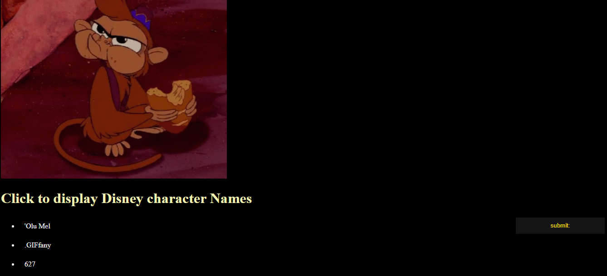

# 📊 Project: Complex API 2

### Goal: Use data returned from one api to make a request to another api and display the data returned
# 📊 Project:Simple API 2

### Goal: Display data returned from an api

Build an application that allows users to input a date and view Disney characters
**Link to project: https://ddcomplextwo.netlify.app/ 

###  My Simple API Project
This project highlights my use of HTML, CSS and javaScript; a nostalgic list of data displaying characters names from Disney Channel.

## How It's Made:

**Tech used:** HTML, CSS, JavaScript

I utilized my skills in javaScript, HTML and CSS to include the use of API's paramteres into my functions and printing the results (depending on users choices)to the document.as well as retrieve data from the API #2
## Lessons Learned:
I learned how to utlize a ul in the dom to append an li which was later used to display the API data.I was able to get a gif returned with the list data.